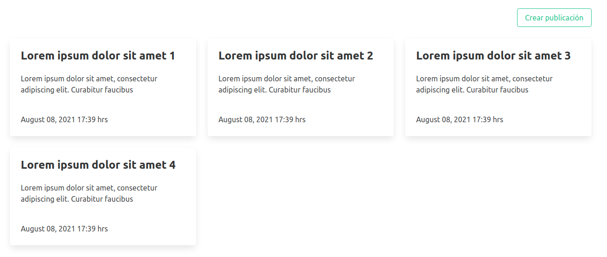
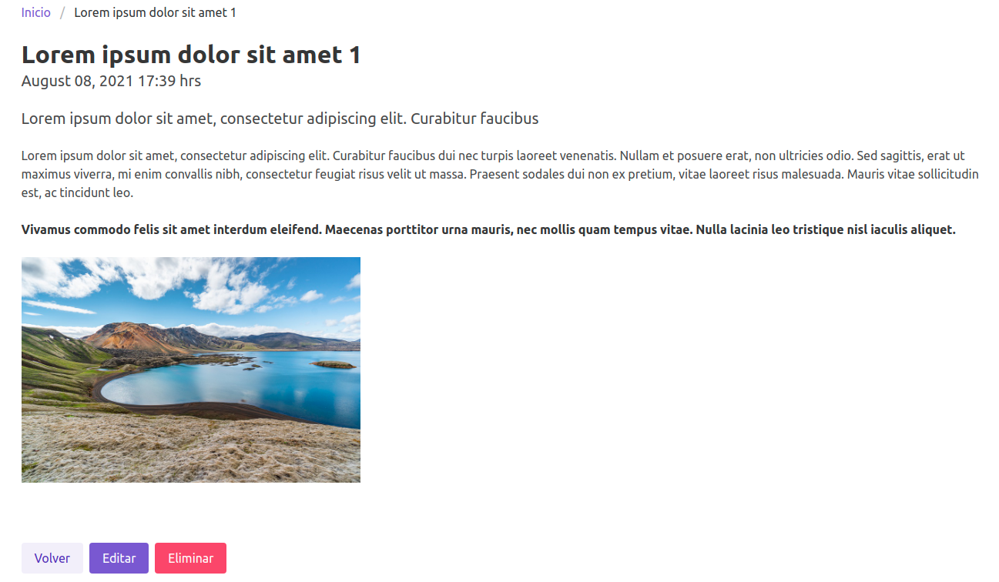
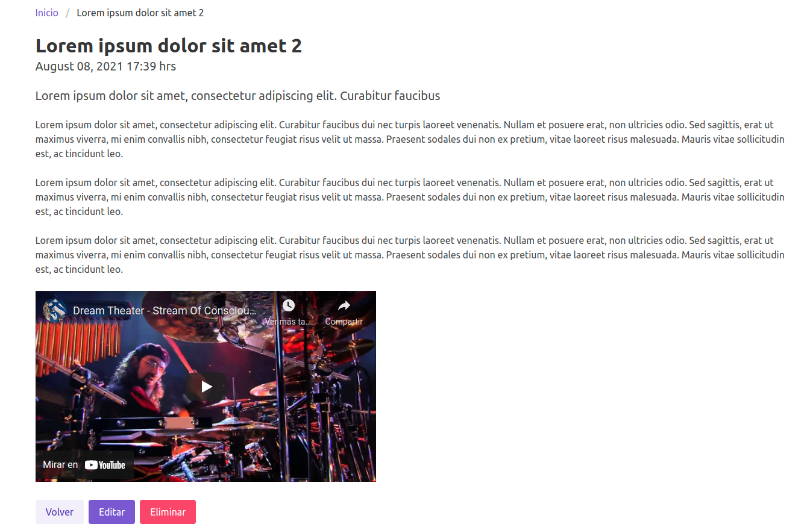
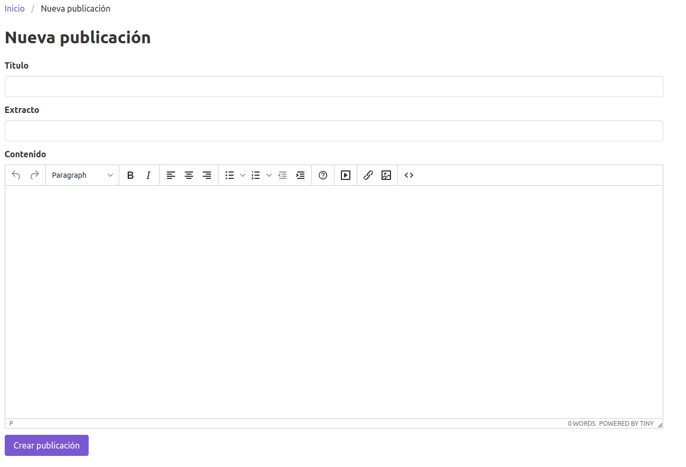
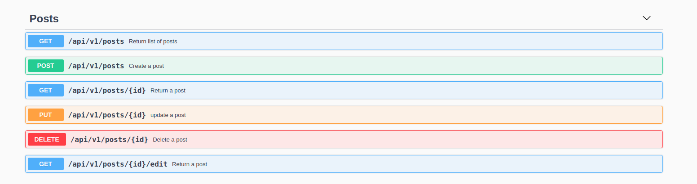

# Tinymce Demo API
## Project

## API docs Swagger

~~~
http://localhost:3000/api-docs
~~~

## Run tests

~~~
rspec
~~~

# Install

## Clone the repository
~~~sh
git clone https://github.com/javierc22/tinymce-demo-api.git
cd tinymce-demo-api
~~~

Check your Ruby version
~~~
ruby -v
~~~

The ouput should start with something like ruby `3.0.2`

If not, install the right ruby version using rbenv (it could take a while):
~~~
rbenv install 3.0.2
~~~

## Install dependencies
~~~
bundle install
~~~

## Initialize the database
~~~
rails db:create db:migrate db:seed
~~~

## Serve
~~~
rails s
~~~

